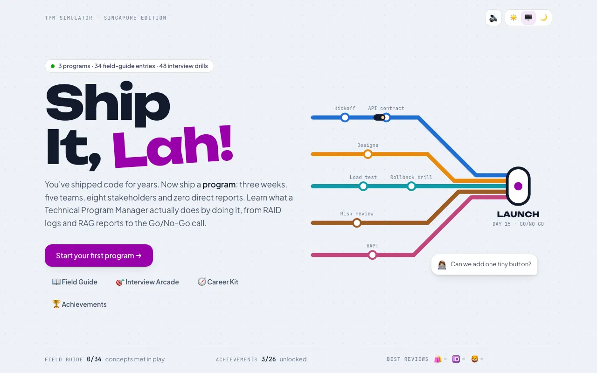
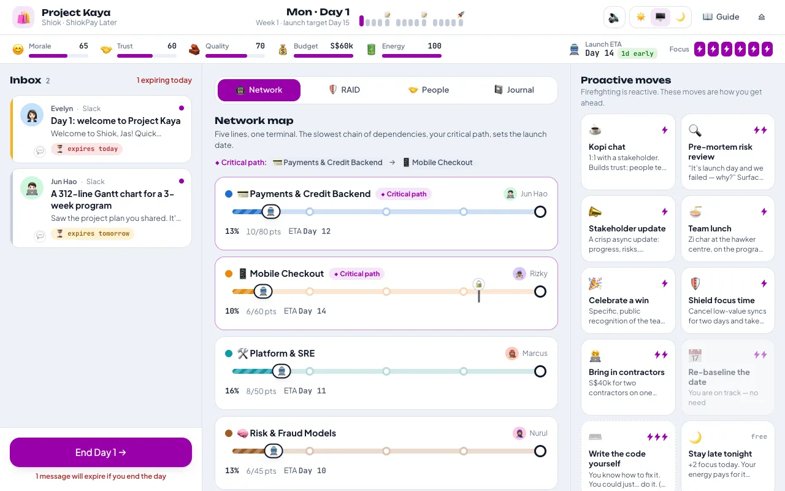
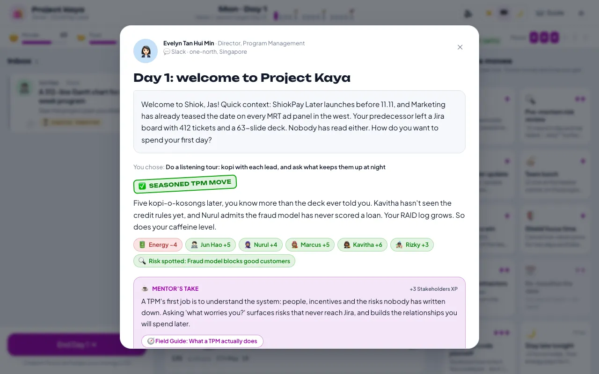
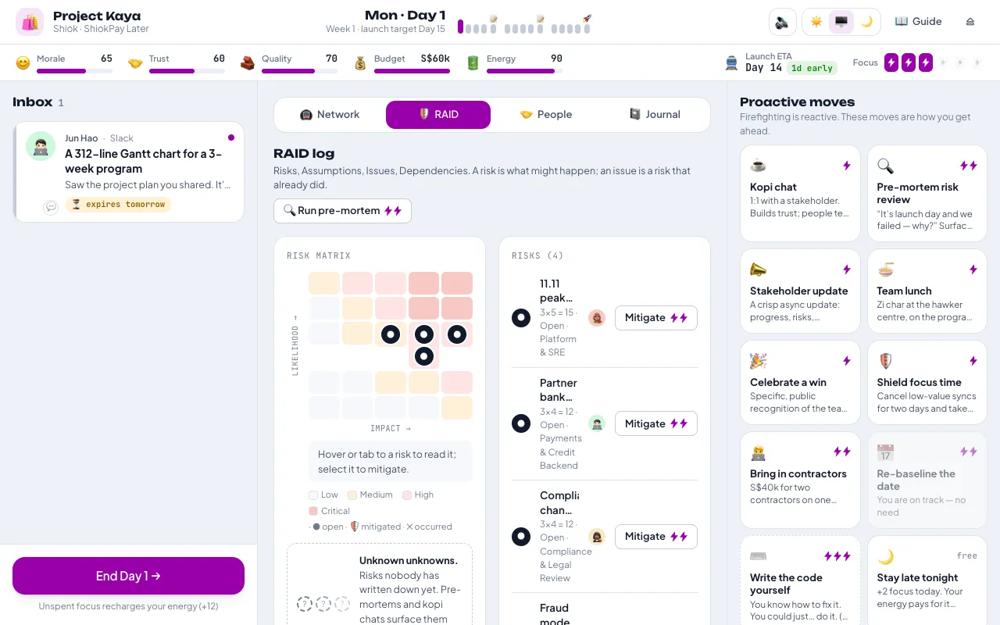
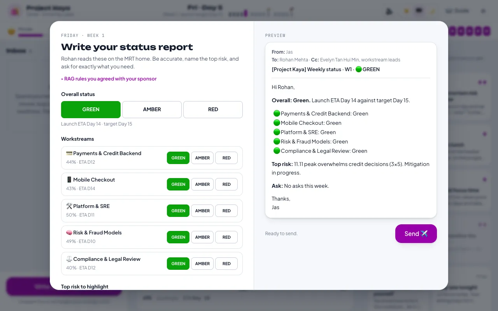
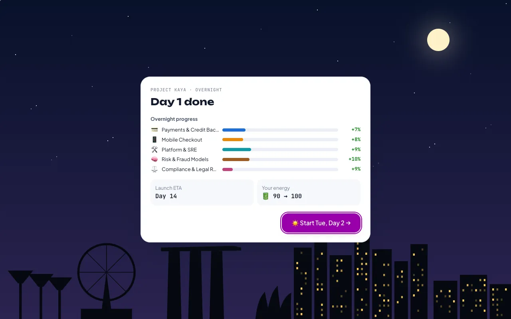
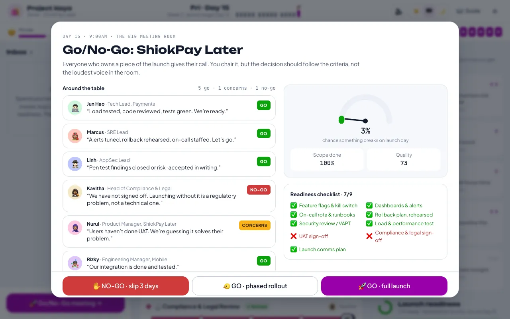
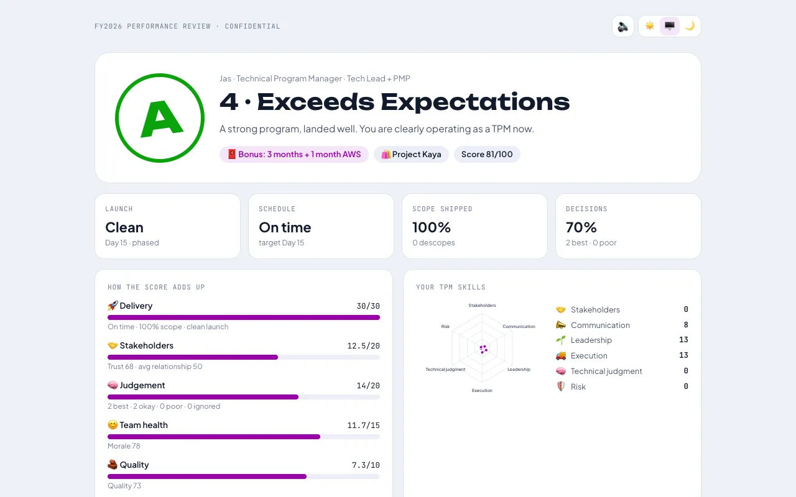
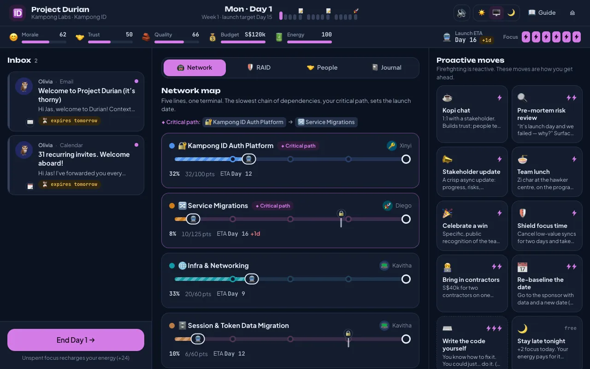

# Ship It, Lah! 🚇

**A Technical Program Manager simulator set in Singapore.** You've shipped code for years. Now ship a *program*: three weeks, five teams, eight stakeholders and zero direct reports.

It's built for engineers and tech leads (especially those holding a PMP) who want to move into a TPM role and need to feel what the job actually is: triaging an inbox of real dilemmas, protecting the critical path, keeping a RAID log, writing honest RAG status reports, and chairing the Go/No-Go call.



## What you'll learn by playing

| You do this in the game | Because TPMs do this at work |
|---|---|
| Triage 2–4 messages a day with only **6 focus** | Your calendar is the constraint. Ignored messages expire and play out without you |
| Watch five workstreams race on an **MRT-style network map** | Dependencies, blockers and the **critical path** decide the launch date, not effort |
| Run pre-mortems and kopi chats to surface **hidden risks** | You can only mitigate risks someone has written down |
| Write a **RAG status report** every Friday | Honest Amber beats a "watermelon" (green outside, red inside), and it gets caught |
| Choose between facilitating and **escalating** | Escalation works, but each one costs more trust than the last |
| Resist "write the code yourself" | The classic ex–tech lead trap: you are now the most expensive engineer, and nobody is doing your job |
| Chair a **Go/No-Go** with a readiness checklist | Launches are decided by criteria agreed in advance, and phased rollouts shrink the blast radius |
| Run a launch-day **incident** | Incident commander, comms cadence, rollback first, blameless post-mortem |

Every choice is graded the way a seasoned TPM would grade it (*Seasoned TPM move* / *Workable* / *Rookie mistake*), with a **mentor's take** explaining why. You can always see how the other options would have graded.

## Features

- **3 programs**, each harder than the last:
  - ⭐ **ShiokPay Later** at *Shiok*, a fictional super-app at one-north. Launch buy-now-pay-later before the 11.11 sale.
  - ⭐⭐ **Project Durian** at *Kampong Labs*, a fictional global tech company's APAC hub. Migrate 40 services to a new auth platform across Singapore, Shenzhen, Bangalore and Seattle, with influence but no authority.
  - ⭐⭐⭐ **Project Merlion** at *Lion City Bank*. Inherit a red "watermelon" program three weeks before cutover: an SI vendor, CAB approval, UAT, VAPT and MAS technology-risk expectations.
- **98 events, 321 graded choices**, with consequence chains: a cheap "yes" in a hallway comes back as scope creep three days later.
- **Three player backgrounds**, including *The Hybrid (Tech Lead + PMP)*, each with its own perks and temptations.
- **Field Guide**: 34 concepts (RAID, RACI, critical path, Brooks's law, MAS TRM, PDPA…), each with in-practice tips, the ex–tech-lead trap, a "from your PMP" bridge, Singapore context and an interview drill.
- **Career Kit**: what a TPM does all week, TPM vs TL vs EM vs PM, the Singapore market and its title zoo, CV rewrites, the interview loop decoded, a 30-60-90 plan, a 4-week practice plan and office Singlish.
- **Interview Arcade**: 48 TPM interview questions in timed rounds with combos, lives, a practice mode and explanations.
- 26 achievements, an end-of-program **performance review** (with bonus months and AWS 🧧), a skills radar and a slip chart.
- Micro-animations throughout, synthesized sound effects, light and dark themes, phone layout, keyboard shortcuts, and `prefers-reduced-motion` support.

| | |
|---|---|
|  |  |
|  |  |
|  |  |
|  |  |

## Run it

```bash
npm install
npm run dev        # http://localhost:5173
```

| Script | What it does |
|---|---|
| `npm run build` | Typecheck and build a static site into `dist/` (relative paths, so any static host works) |
| `npm test` | Engine, content-validation and balance tests (Vitest) |
| `npm run simulate` | Bots play 480 full programs and print the balance table |
| `npm run lint` | oxlint |

Progress, the Field Guide and achievements are saved in `localStorage`. The game still works if storage is blocked.

## How it's built

- **Vite + React 19 + TypeScript**, **Tailwind CSS v4**, **Motion** for animation, **Zustand** for state.
- **A pure, seeded engine** (`src/game/`). Every move is a function `(state, input) → newState` with a deterministic RNG, so runs are reproducible and testable. The schedule model simulates each workstream forward to project the launch date and walk back the critical path.
- **Content is typed data** (`src/content/`). Scenarios, events, risks and guide entries are plain objects checked by `src/game/validate.ts`: referential integrity, text limits, effect magnitudes, and fairness checks so the best answer isn't always first or always the longest.
- **Balance is tested, not guessed.** `src/game/__tests__/simulate.test.ts` plays every scenario with four scripted players and asserts that seasoned play beats a novice, a novice beats random clicking, and random clicking beats rookie habits. It also asserts that a learner who is right about half the time is rarely fired:

  | Avg score (40 runs each) | Seasoned | Novice | Random | Rookie |
  |---|---|---|---|---|
  | ShiokPay Later ⭐ | 98 | 76 | 57 | 16 |
  | Project Durian ⭐⭐ | 99 | 74 | 52 | 16 |
  | Project Merlion ⭐⭐⭐ | 92 | 66 | 40 | 15 |

```
src/
  game/          engine, schedule & critical path, actions, status reports, launch, scoring, achievements
  content/       scenarios/, events/ (people, delivery, system), guide/ (concepts, career), interview
  components/    title, setup, game (boards, modals), ending, guide, arcade, charts, ui
  store/         Zustand stores: the run in progress + persistent meta (settings, unlocks)
docs/
  CONTENT_GUIDE.md   how to write new scenarios and events
```

Want to add a program? Read [`docs/CONTENT_GUIDE.md`](docs/CONTENT_GUIDE.md), add a file under `src/content/scenarios/`, register it in `src/game/content.ts`, and the validation tests will tell you what's missing.

## A note on accuracy

Companies, people and products in the game are fictional. Regulatory references (MAS Technology Risk Management expectations, PDPA breach notification, IM8) are simplified for teaching and kept to well-established points. Check MAS, PDPC and MOM's official guidance before relying on any detail at work or in an interview.
